<p align="center">
  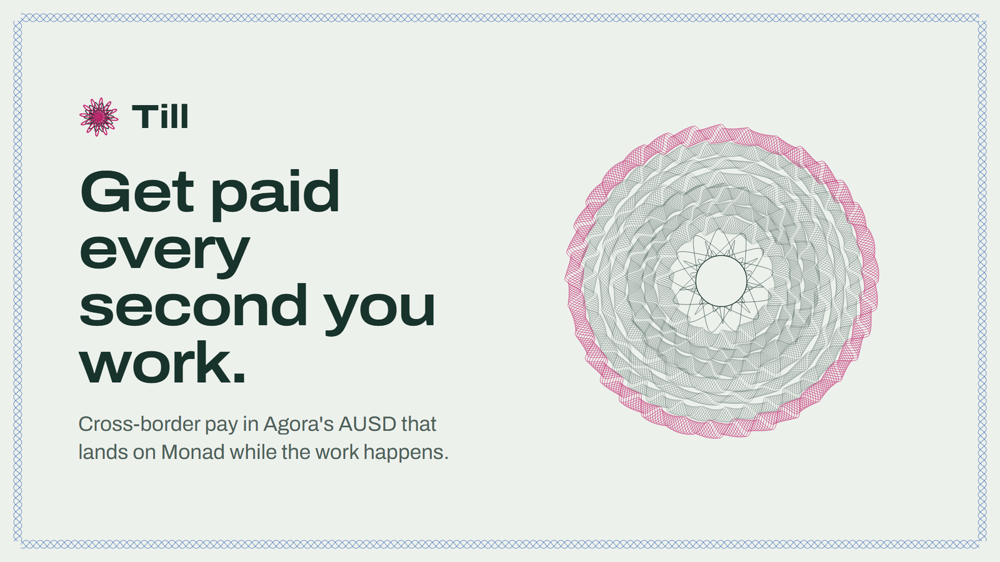
</p>

<p align="center">
  <a href="https://till-pay.vercel.app"></a>
  
  
  
  <a href="https://github.com/RohanGlitched/till-pay/actions/workflows/ci.yml"></a>
  
</p>

<h3 align="center">Cross-border freelancers get paid every second they work.<br/>In Agora's AUSD, on Monad, with a passkey and no gas.</h3>

<p align="center"><b><a href="https://till-pay.vercel.app">Try it live</a></b> &nbsp;|&nbsp; <a href="VERIFY.md">Verify it on chain</a> &nbsp;|&nbsp; <a href="SECURITY.md">Security</a></p>

---

<p align="center">
  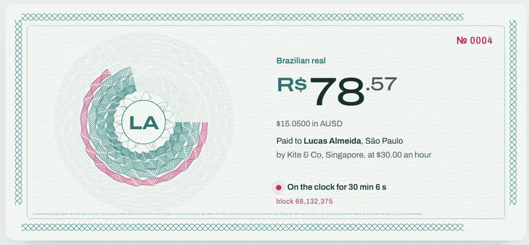
  <br/><sub>A real tab on Monad testnet, recorded from the live site. Lucas in São Paulo is paid by a studio in Singapore; each band of the rosette is a stretch of work, and the amount rolls in his own currency.</sub>
</p>

## The problem

Freelancers outside the US and Europe wait for their money and pay to receive it.

| | |
|---|---|
| **6.49%** | average cost of sending money across borders ([World Bank, Q1 2025](https://remittanceprices.worldbank.org/)) |
| **~10 days** | before hourly marketplace pay is released after the work week ([Upwork](https://www.upwork.com/resources/understanding-freelancer-payment-protection)) |
| **435M** | online gig workers worldwide ([World Bank, 2023](https://openknowledge.worldbank.org/entities/publication/ebc4a7e2-85c6-467b-8713-e2d77e954c6c)) |

And if a client disappears, the freelancer chases an invoice for work already done.

## What Till does

A client opens a **tab**: an hourly rate and a budget in **AUSD**, Agora's digital dollar. The budget waits in the Till contract on Monad, which can only pay the freelancer for time on the clock or send it back to the client. While the freelancer is **clocked in**, pay builds up every second; while the tab is open on screen it lands in their wallet every few seconds, each payout settling in about a second. Either side can stop the clock at any moment, the client can pause pay or top up, and closing the tab returns every unspent cent in the same block.

**Nobody is ever owed more than a few seconds of work.**

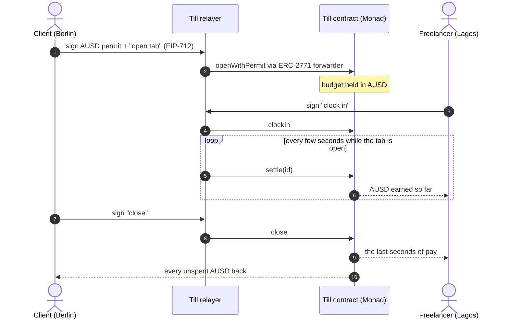
```mermaid
sequenceDiagram
    autonumber
    actor C as Client (Berlin)
    participant R as Till relayer
    participant T as Till contract (Monad)
    actor F as Freelancer (Lagos)
    C->>R: sign AUSD permit + "open tab" (EIP-712)
    R->>T: openWithPermit via ERC-2771 forwarder
    Note over T: budget held in AUSD
    F->>R: sign "clock in"
    R->>T: clockIn
    loop every few seconds while the tab is open
        R->>T: settle(id)
        T-->>F: AUSD earned so far
    end
    C->>R: sign "close"
    R->>T: close
    T-->>F: the last seconds of pay
    T-->>C: every unspent AUSD back
```

## Try it in one minute

1. Open **[till-pay.vercel.app](https://till-pay.vercel.app)** and choose **Open a tab**.
2. **Create an account with a passkey** (or continue with email, or use a practice wallet). Privy creates a wallet; there's no seed phrase and no gas.
3. 25 test AUSD arrive in your new wallet by themselves (there's also a **Get 25 test AUSD** button).
4. Pick a demo freelancer, say $40 an hour and a $3 budget, and open the tab. They clock in by themselves within seconds; keep the page open and watch payouts land.
5. Pause pay, top up, or close the tab and see the refund in the pay stub. To be the freelancer, choose **Someone I'll invite by link** and open the link on your phone.

## Screens

<table>
  <tr>
    <td width="50%">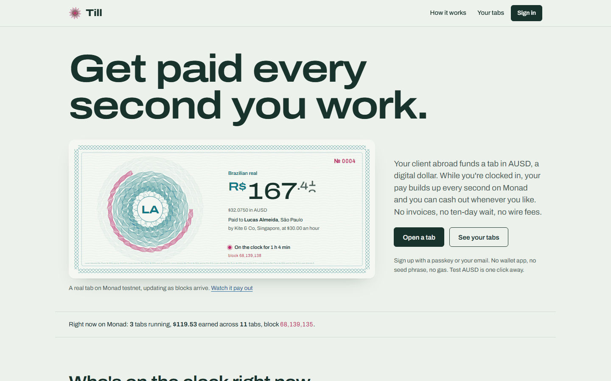<br/><sub><b>Home.</b> The hero is a real tab running on Monad right now.</sub></td>
    <td width="50%">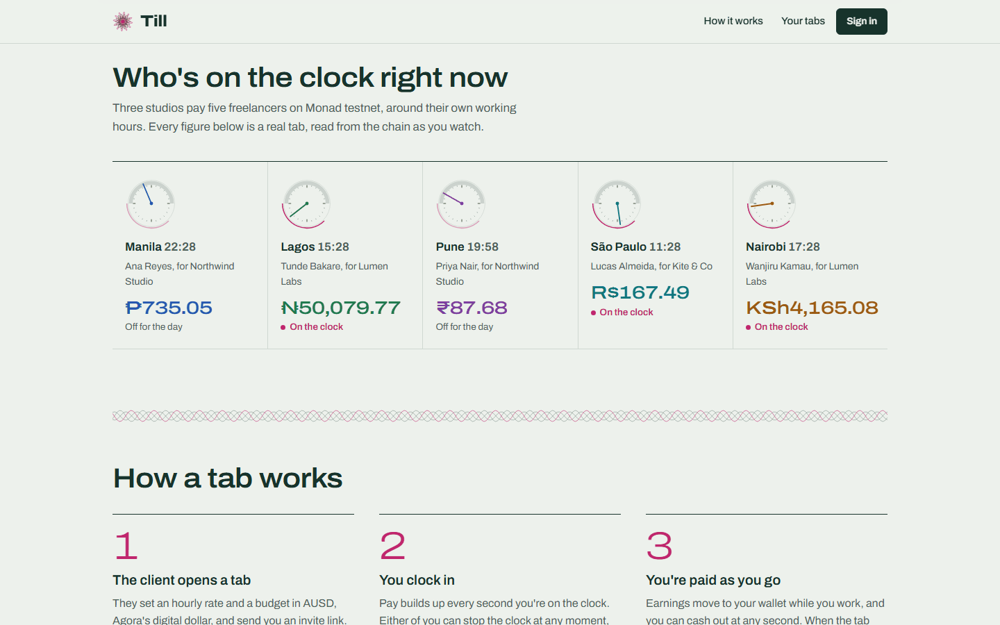<br/><sub><b>Who's on the clock.</b> Five freelancers in five cities, each with a 24-hour dial and live earnings in their own currency.</sub></td>
  </tr>
  <tr>
    <td>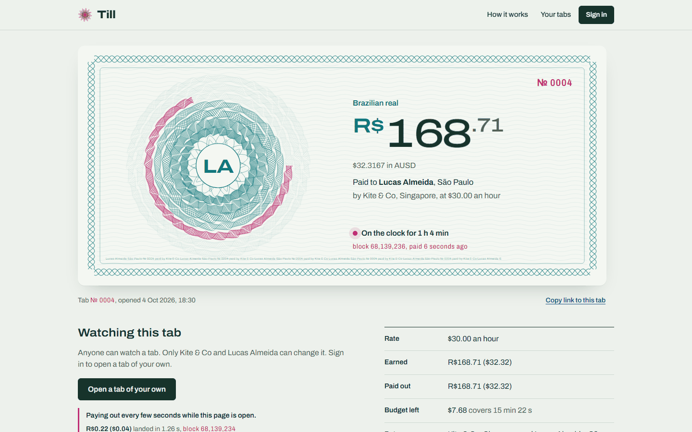<br/><sub><b>A live tab.</b> Payouts every few seconds while the page is open, each with how long it took to land.</sub></td>
    <td>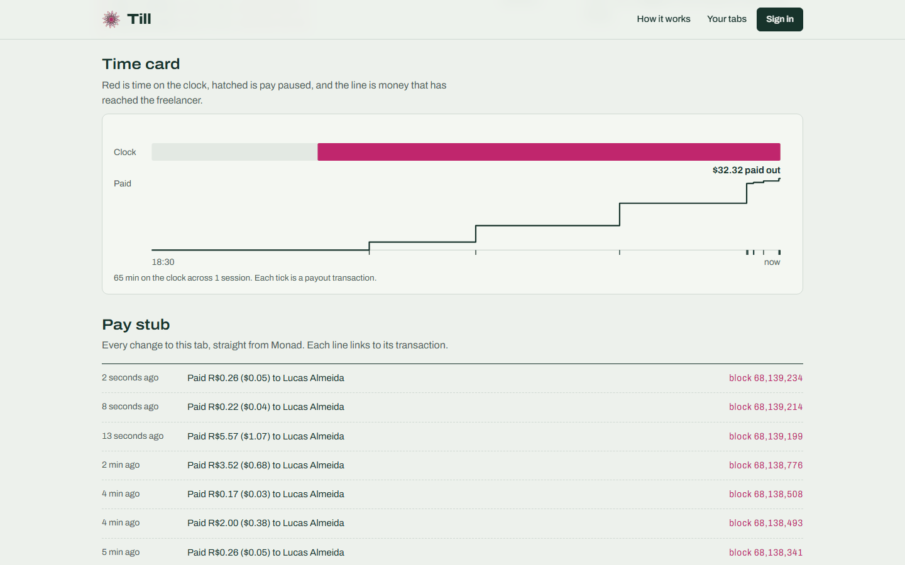<br/><sub><b>Time card and pay stub.</b> Read straight from the chain; every line links to its transaction.</sub></td>
  </tr>
  <tr>
    <td>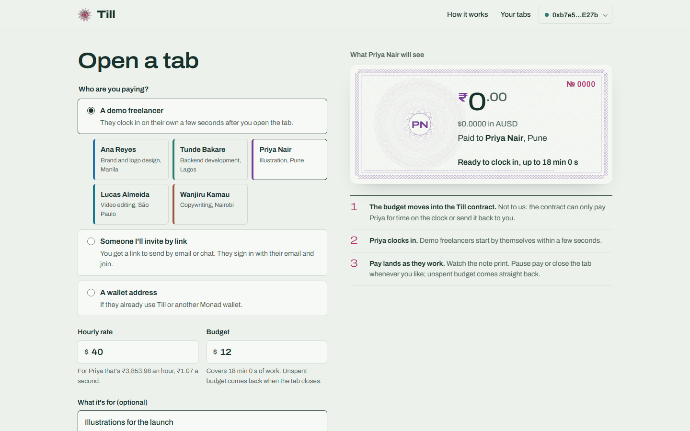<br/><sub><b>Open a tab.</b> The note on the right is what the freelancer will see, in rupees, before you sign.</sub></td>
    <td>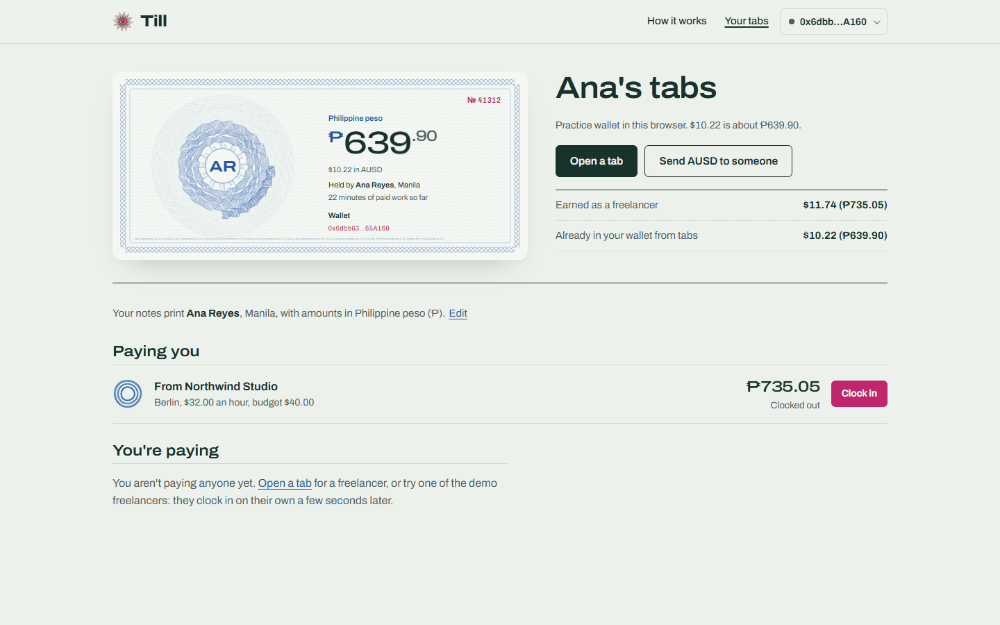<br/><sub><b>Your tabs.</b> Your wallet prints as your own note, with a statement of what you earned and what's in your wallet.</sub></td>
  </tr>
  <tr>
    <td>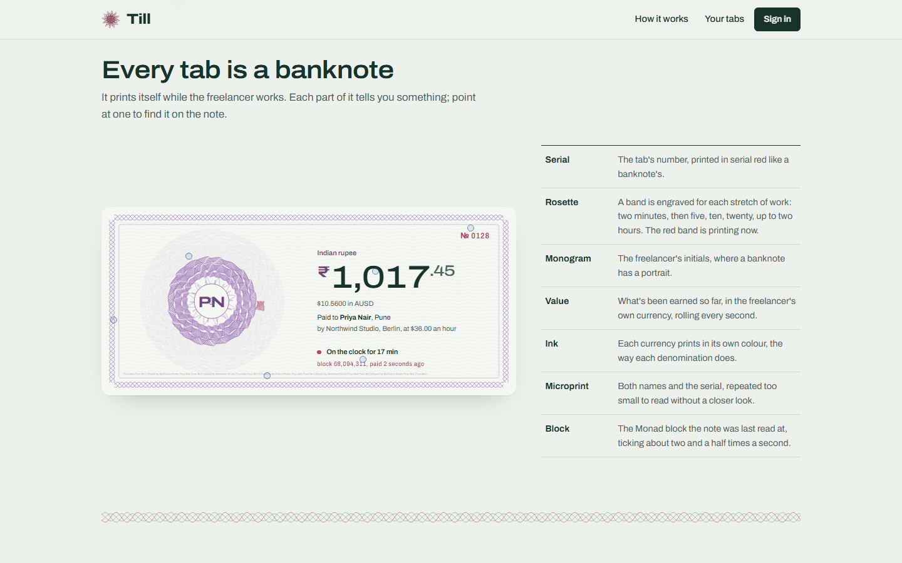<br/><sub><b>Every tab is a banknote.</b> Serial, rosette, monogram, value, ink, microprint and block, each meaning something.</sub></td>
    <td>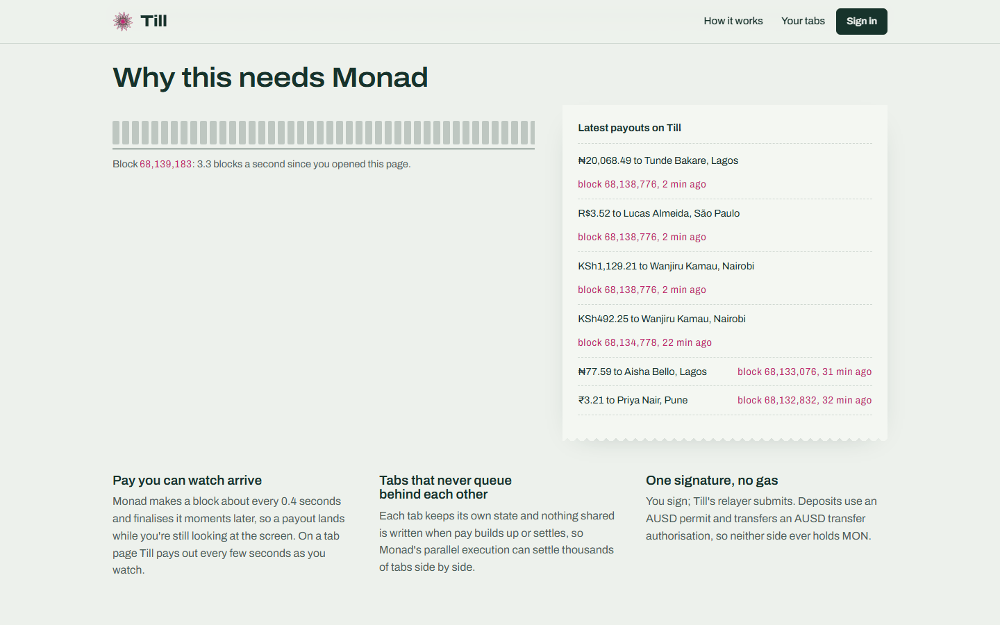<br/><sub><b>Why Monad.</b> Monad blocks arriving live, with the latest real Till payouts printed on a receipt.</sub></td>
  </tr>
  <tr>
    <td>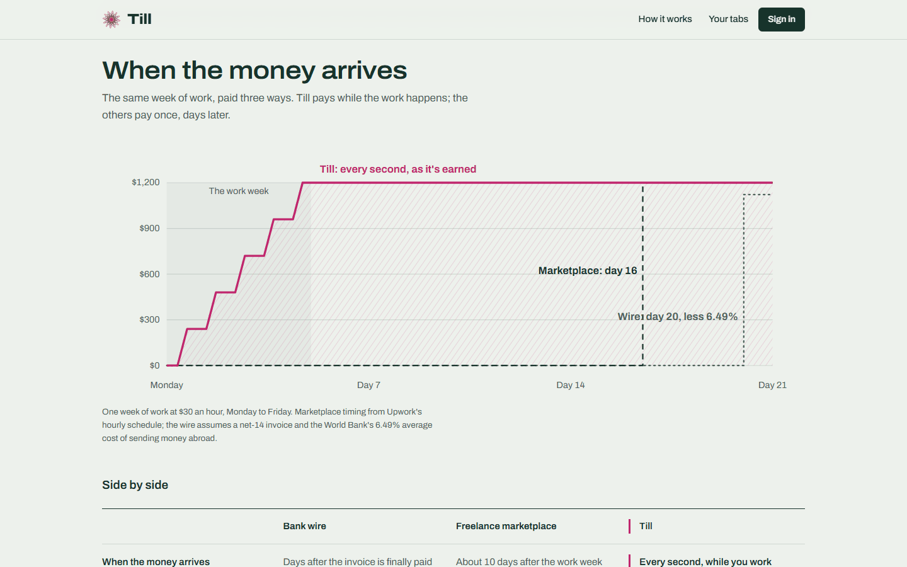<br/><sub><b>When the money arrives.</b> The same week of work paid by Till, a marketplace and a wire.</sub></td>
    <td>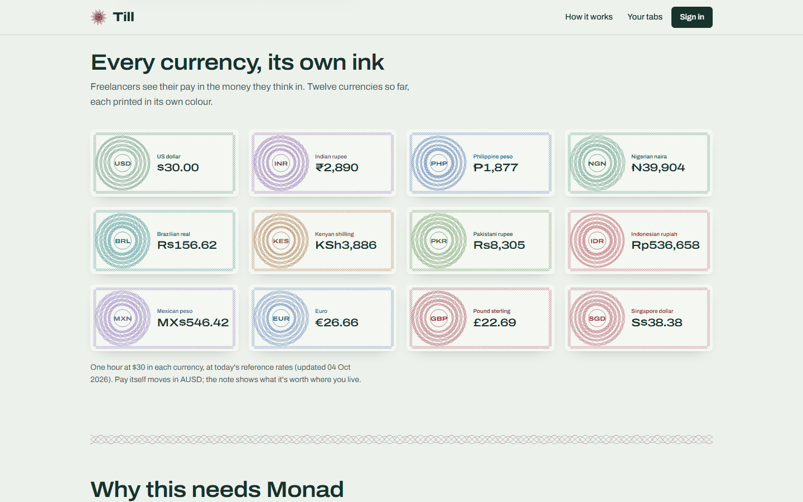<br/><sub><b>Every currency, its own ink.</b> Twelve currencies at live reference rates.</sub></td>
  </tr>
  <tr>
    <td>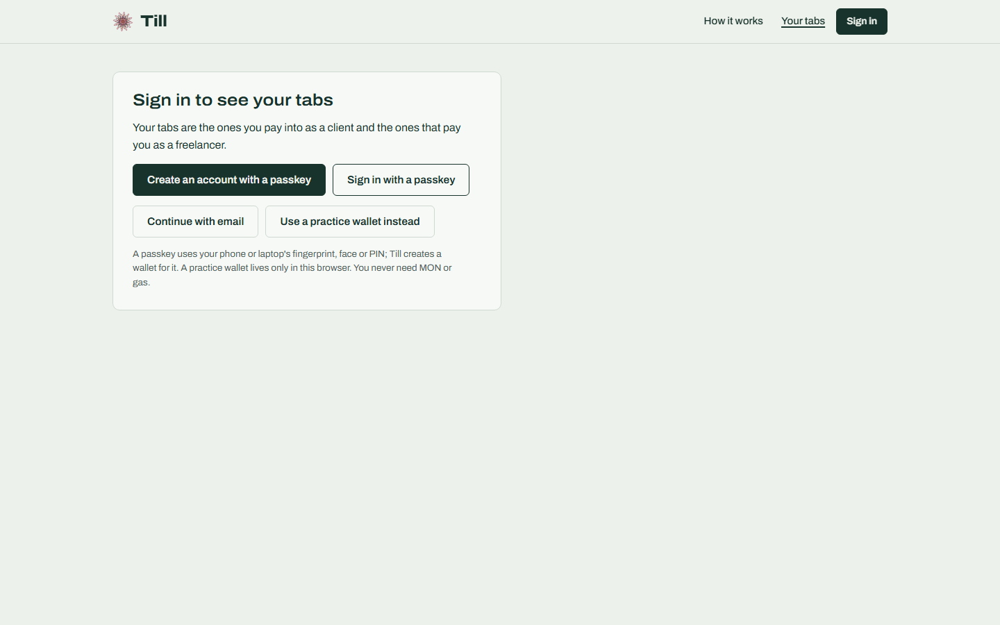<br/><sub><b>Passkey sign-up.</b> Privy embedded wallets, with email and practice wallets as fallbacks.</sub></td>
    <td>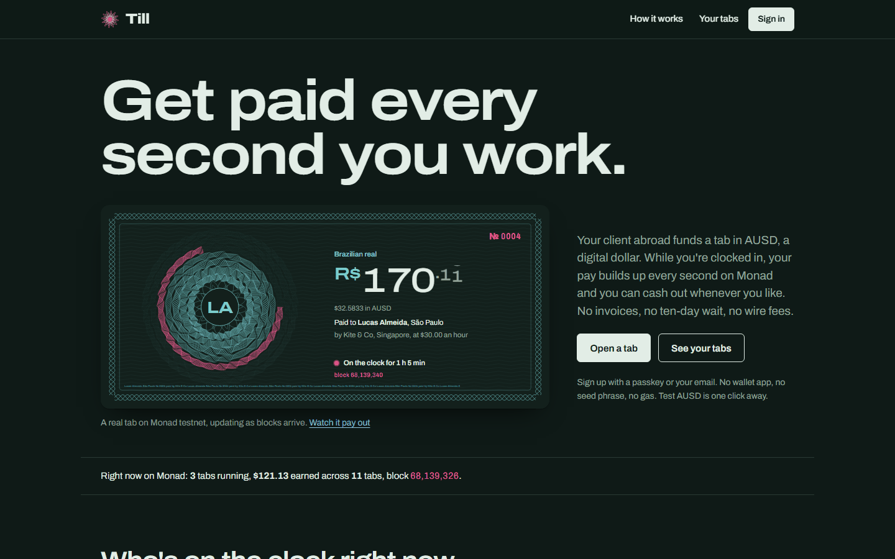<br/><sub><b>Dark mode.</b> Every ink has a night version.</sub></td>
  </tr>
</table>

<p align="center">
  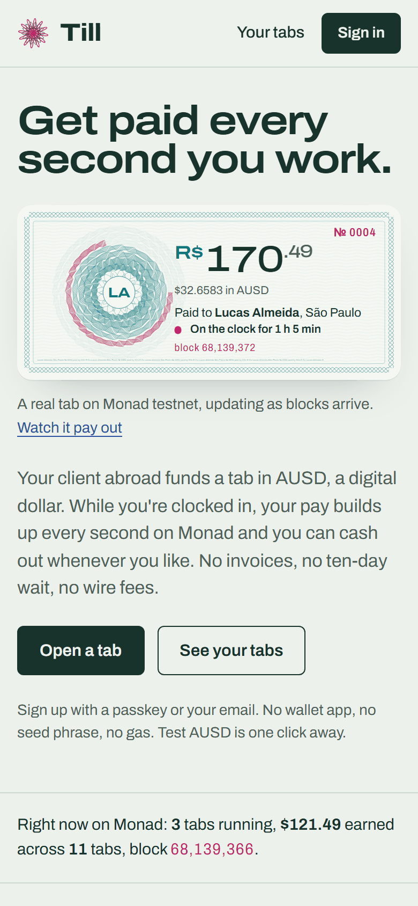
  &nbsp;
  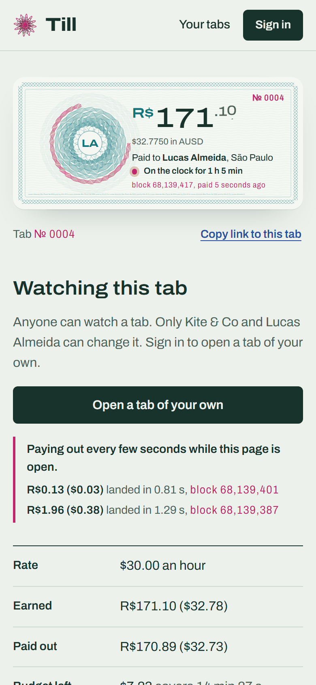
  &nbsp;
  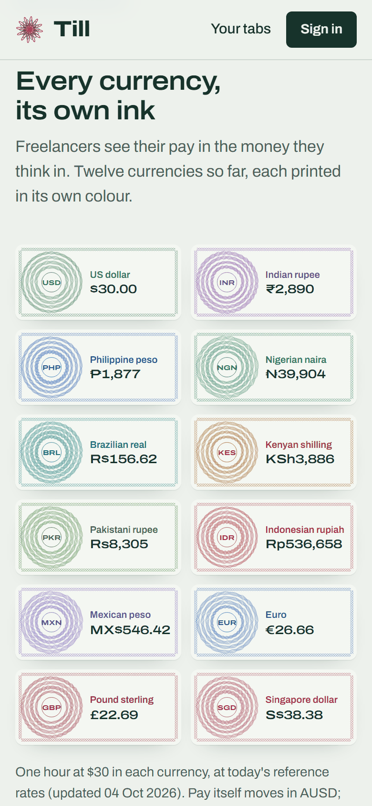
  <br/><sub>Built phone-first for freelancers: home, a live tab and the currency sheet at 390 px.</sub>
</p>

## Money: Agora's AUSD

Tabs are funded and paid in [AUSD](https://www.agora.finance), Agora's dollar stablecoin on Monad. AUSD supports **EIP-2612 permits** and **EIP-3009 transfer authorisations**, so opening a tab, topping up and sending AUSD to anyone are each one signature with no gas. Your tabs has **Send AUSD to someone** for one-off payments; the receiver sees it a second later, in their own currency. The in-app faucet hands out 25 test AUSD and refills itself from Agora's testnet faucet.

## Why Monad

- **Pay you can watch arrive.** Blocks every ~0.4 s with fast finality: a payout lands while the freelancer is still looking at the screen. The tab page settles every few seconds and shows how long each payout took (about 0.8 s from a browser in India). Every payout is a transaction the relayer pays for, so the pace eases the longer a page stays open, and the last seconds of pay are sent the moment a clock stops.
- **Built for parallel execution.** Pay accrues from timestamps and each tab keeps its own state. Clocking and settling never write shared storage, so independent tabs never contend; `settleMany` pays many tabs in one transaction.
- **Monad-aware engineering.** Monad charges the gas *limit*, not gas used, so every transaction (relayer, faucet, bots) is sent with Monad's own gas estimate plus a small margin, never a blanket limit. Public RPCs cap `eth_getLogs` at 100 blocks, so each tab links its changes block to block (`Activity(id, prevBlock)`) and the app reads a full pay stub with one exact-block query per step, with no indexer.
- **Live from the chain.** The site follows Monad's `newHeads` subscription; the landing page's numbers, world clocks and receipt all come from contract state and exact-block log reads.

## Contracts (Monad testnet, chain 10143)

| | Address | |
|---|---|---|
| **Till** | [`0xeb6c2c519c9bcc4495364c34ac116c20098113d1`](https://testnet.monadvision.com/address/0xeb6c2c519c9bcc4495364c34ac116c20098113d1) | Sourcify exact match |
| Gasless forwarder (OpenZeppelin `ERC2771Forwarder`) | [`0xB0Af71Dfb11df900B2B1a63De0D156e7f035B4D1`](https://testnet.monadvision.com/address/0xB0Af71Dfb11df900B2B1a63De0D156e7f035B4D1) | Sourcify exact match |
| AUSD (Agora) | [`0xa9012a055bd4e0eDfF8Ce09f960291C09D5322dC`](https://testnet.monadvision.com/address/0xa9012a055bd4e0eDfF8Ce09f960291C09D5322dC) | [Agora's deployments](https://docs.agora.finance/developer/contract-deployments) |

No owner, no admin key, no upgrade path, no fee switch: earned pay can only go to the freelancer and unspent budget only back to the client.

## Proof

| Claim | Proof |
|---|---|
| Pay accrues per second, only while clocked in | `test_paysBySecondAndRefundsTheRest`, `test_noPayWhileClockedOut` |
| The client can pause pay at any moment | `test_clientHoldStopsTheClock` |
| Pay never exceeds the budget | `test_budgetCapsPayAndTopUpRestartsTheShift` |
| Invite links can't be stolen from the mempool | `test_inviteClaimCannotBeStolen` |
| Paid + refunded always equals the budget | `testFuzz_moneyIsConserved` (1,000 runs) |
| Whatever happens in any order, escrow equals what open tabs still hold and pay never goes down | `TillInvariantTest`: 2 stateful invariants over 12,800 random actions |
| Edge cases hold: top-ups mid-shift and at exhaustion, duplicate settles, extreme rates, issuer freezes, dust tabs | `TillEdges.t.sol`, 32 tests |
| Fully gasless with an AUSD permit and the forwarder | `test_gaslessOpenWithPermitAndClockIn`, plus a fork test with Agora's real AUSD |
| Every action works on Monad testnet | [VERIFY.md](VERIFY.md): 17 transactions, one per action, with fresh wallets |
| The whole UI works on the live site | `scripts/e2e.cjs`: faucet, profile, open, payouts, pause, close, invite on a phone |

```bash
cd contracts
forge test                                                   # 46 tests: units, edges, a 1,000-run fuzz, stateful invariants
forge test --match-contract Fork --fork-url monad_testnet    # Agora AUSD on a Monad fork
```

## Architecture

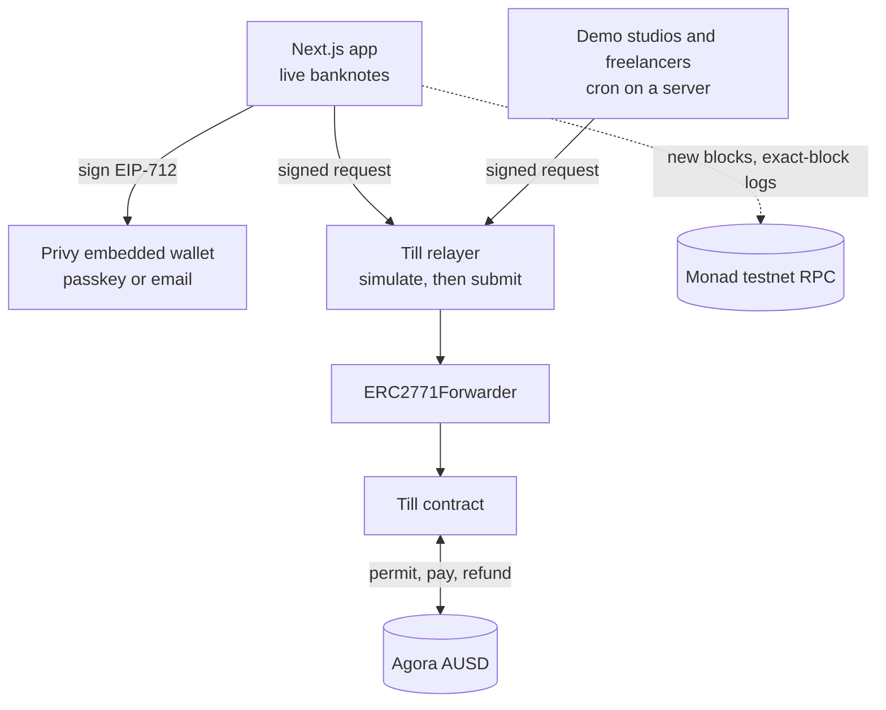
```mermaid
flowchart TB
    APP["Next.js app<br/>live banknotes"]
    WAL["Privy embedded wallet<br/>passkey or email"]
    REL["Till relayer<br/>simulate, then submit"]
    BOTS["Demo studios and freelancers<br/>cron on a server"]
    FWD["ERC2771Forwarder"]
    TILL["Till contract"]
    AUSD[("Agora AUSD")]
    RPC[("Monad testnet RPC")]
    APP -->|sign EIP-712| WAL
    APP -->|signed request| REL
    BOTS -->|signed request| REL
    REL --> FWD --> TILL
    TILL <-->|permit, pay, refund| AUSD
    APP -.->|new blocks, exact-block logs| RPC
```

```
contracts/   Till.sol (Solidity 0.8.28, OpenZeppelin 5.4), Foundry tests, deploy script
web/         Next.js 15 app and API routes: relay, send, settle, faucet, live stats, exchange rates
bots/        Seeded studios (Berlin, Austin, Singapore) and freelancers (Manila, Lagos, Pune,
             São Paulo, Nairobi) on their local working hours, the keeper, and the proof run
scripts/     ABI export, end-to-end UI test, screenshots
```

## Run it

```bash
cd contracts && forge test
cd web && npm install && npm run dev
```

Web environment: `NEXT_PUBLIC_TILL_ADDRESS`, `NEXT_PUBLIC_FORWARDER_ADDRESS`, `NEXT_PUBLIC_PRIVY_APP_ID` (without it the app offers practice wallets), and server-only `KEEPER_KEY` and `FAUCET_KEY`.

## Roadmap

1. **Mainnet** on AUSD with the same contract, audited.
2. **Local cash-out partners**: pesos, naira, rupees and shillings straight to bank accounts and mobile money.
3. **Time-tracker plug-in**: any tool that knows you're working can clock you in and out.

## Built during Monad Metropolis

All code in this repository was written during the hackathon (October 2026); no earlier project code is reused.

MIT licence.
